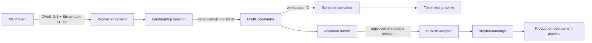
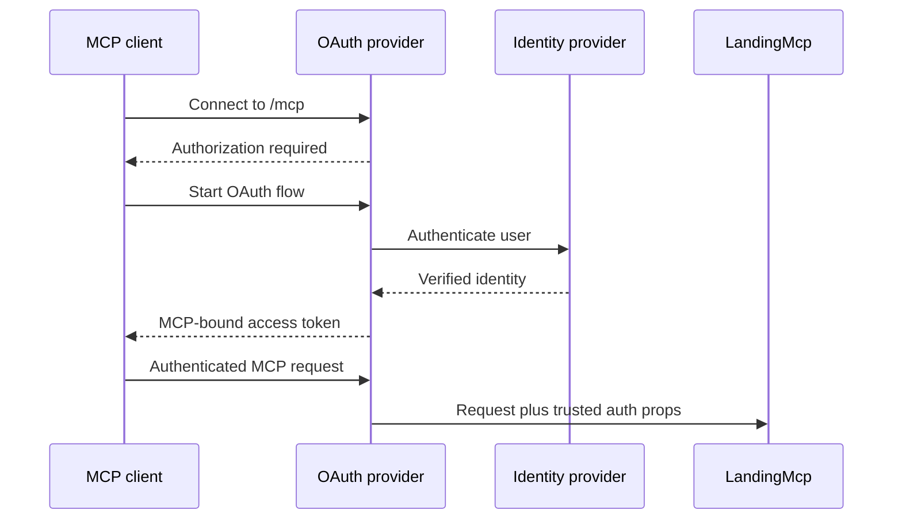
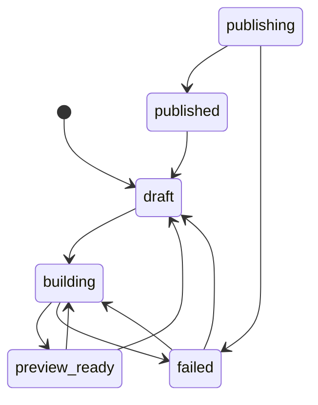
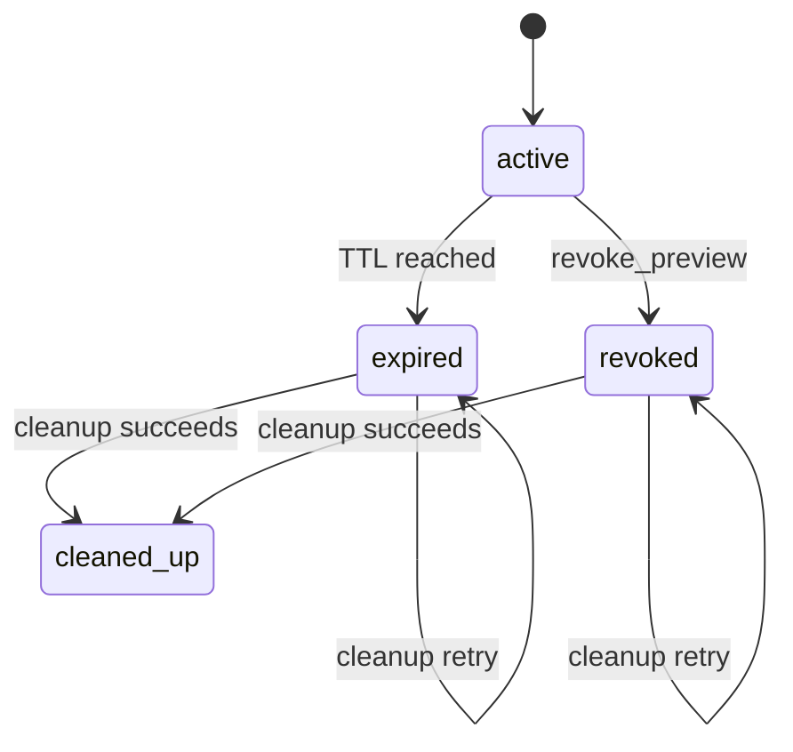

# Architecture and layer integration

## Purpose

`skydeo-landing-mcp` is the hosted control plane for the Skydeo landing-page
workflow. An authenticated user should be able to create a draft, receive a live
preview, request revisions, and explicitly approve one immutable revision for
production without cloning or directly accessing the landing-page repository.

The control plane and the landing-page source repository are deliberately
separate:

- `skydeo-landing-mcp` owns identity, authorization, MCP tools, draft lifecycle,
  isolated execution, preview access, approval, and publish orchestration.
- `skydeo-landings` remains the canonical source and deployment configuration for
  production landing pages.

## End-to-end topology



The diagram describes the target flow. The repository currently implements the
Worker/MCP foundation, draft model, draft Durable Object, direct-HTML Sandbox
previews, and preview routing. Repository workspace commands and publishing are
not implemented.

## Layer 1: MCP client

**Status: Planned for authenticated production use.**

The user connects an MCP-capable host such as Codex, Claude, or another remote MCP
client to one hosted `/mcp` URL. The client is a user interface and protocol peer;
it is not trusted as a source of organization identity, permissions, draft state,
or approval state.

The intended tool sequence is:

1. `create_draft`
2. `update_draft`
3. `get_draft`
4. repeat update and get calls
5. `request_publish` (planned)
6. `confirm_publish` (planned)

The first three tools and `get_service_status` exist today. Inputs are validated
with Zod, and every mutating tool derives the actor and organization from trusted
server context rather than accepting them as client parameters.

## Layer 2: Worker entrypoint and routing

**Status: Implemented as a deploy-closed foundation.**

[`src/index.ts`](../src/index.ts) is the public Worker entrypoint. It currently
provides:

- `GET /healthz` for a shallow process health response.
- `/mcp` routing to `LandingMcp.serve("/mcp")` during explicit local development.
- a production-safe default that returns `503` while OAuth is unconfigured.
- exports for every Durable Object class required by Wrangler.

[`wrangler.jsonc`](../wrangler.jsonc) enables `nodejs_compat`, registers the three
Durable Object bindings, configures the Sandbox container, and enables Workers
observability.

The temporary `MCP_AUTH_MODE` switch is not an authentication system. It exists
only to keep an accidental deployment closed while still allowing local MCP
Inspector testing. It must be removed when the OAuth provider owns `/mcp`.

## Layer 3: Authentication and authorization

**Status: Implemented and verified in production.**

The integration wraps the MCP handler with Cloudflare's Workers OAuth
Provider. The provider is responsible for MCP OAuth endpoints, client
registration, access-token validation, and passing trusted identity context into
the MCP session.



`AuthContext` in [`src/mcp/landing-mcp.ts`](../src/mcp/landing-mcp.ts) sketches the
minimum application context: subject, name, email, organization ID, and
permissions. Its shape is not yet populated or enforced. Because this service is
for Skydeo team members only, the organization is the fixed Skydeo tenant; it is
not selected by the MCP client or inferred from a prompt.

Authorization must be checked per tool. Suggested scopes are:

| Scope | Allows |
| --- | --- |
| `landings:read` | Read draft metadata, build status, and preview links |
| `landings:write` | Create drafts and request revisions |
| `landings:publish` | Request and confirm production publishing |

Authentication answers who the user is. Authorization answers which tools that
team member can access. Neither decision may be delegated to the model or inferred
from free-form prompts.

The selected identity provider is **Cloudflare Access**. The Worker OAuth Provider
acts as the OAuth 2.1 server seen by MCP clients and uses a Cloudflare Access for
SaaS OIDC application as its upstream identity provider. Access policy is the
authoritative Skydeo membership gate. The Worker must not rely on a client-supplied
email address or a hard-coded email-domain check as a substitute for that policy.

The required Cloudflare-side setup is intentionally separate from source control:

1. create a generic Access for SaaS OIDC application;
2. attach an Access policy that allows only the intended Skydeo team identities;
3. register `/callback` for both the local Worker and the final production MCP
   hostname;
4. create the OAuth KV namespace used for short-lived state and provider data;
5. store the Access client secret and cookie-encryption key as Worker secrets.
6. create a self-hosted Access application for `*.landing-mcp.skydeo.com` using the
   same team membership policy;
7. store that application's audience as `PREVIEW_ACCESS_AUD`.

The source integration uses `ACCESS_CLIENT_ID`, `ACCESS_CLIENT_SECRET`,
`ACCESS_AUTHORIZATION_URL`, `ACCESS_TOKEN_URL`, `ACCESS_JWKS_URL`, and
`COOKIE_ENCRYPTION_KEY`. None of those secret values belongs in Git.

## Layer 4: MCP session agent

**Status: Implemented for the draft/edit/preview loop.**

[`LandingMcp`](../src/mcp/landing-mcp.ts) extends Cloudflare's `McpAgent`. It owns
the MCP server instance, registers tools, receives OAuth props in the future, and
provides the Streamable HTTP session handled by `McpAgent.serve()`.

An MCP session Durable Object is useful for protocol/session concerns, but it is
not the authoritative draft store. A user can reconnect, change MCP clients, or
resume work later under a different MCP session. For that reason, tools must load
drafts from `DraftCoordinator` by stable application identity.

The current `LandingMcp` state is intentionally empty. Session-local state should
only contain ephemeral interaction data that is safe to lose independently of a
landing draft.

## Layer 5: Landing domain model

**Status: Implemented.**

[`src/domain/draft.ts`](../src/domain/draft.ts) defines the portable draft record
and allowed status transitions:



The domain layer has no dependency on MCP, Durable Objects, Sandbox, or Git. This
keeps lifecycle validation testable and prevents transport concerns from defining
business rules.

Revisions have distinct meanings:

- `baseRevision` — immutable canonical repository revision used to create the
  workspace.
- `currentRevision` — latest successfully built draft revision.
- `approvedRevision` — exact revision the user approved for publishing.

Publishing must fail if the current revision no longer equals the approved
revision.

## Layer 6: Draft coordination and persistence

**Status: Implemented and connected to MCP tools.**

[`DraftCoordinator`](../src/drafts/draft-coordinator.ts) is a SQLite-backed Durable
Object. The target sharding key is one deterministic object per organization and
draft, conceptually:

```text
draft:<organization-id>:<draft-id>
```

This layer is the coordination atom for one landing draft. It serializes lifecycle
transitions, persists revision and URL metadata, and prevents two requests from
independently publishing the same draft.

The Durable Object supports creating, reading, updating, revoking, and cleaning up
one draft preview. Create and update render an immutable SHA-256-addressed HTML
revision in the draft's Sandbox, and reads and updates verify the authenticated
organization against the stored `organizationId`. Updates also use an expected
revision to reject lost updates. Preview lifecycle metadata is persisted as
`preview_expires_at`, `preview_revoked_at`, `preview_cleanup_status`, and
`preview_cleaned_at`. Approval records and idempotent publish results remain future
work.

The MCP layer should obtain a typed stub from the `DRAFTS` binding and call RPC
methods; it should not expose the Durable Object directly over public HTTP.

## Layer 7: Isolated Sandbox workspace

**Status: Implemented for direct-HTML previews; repository workspaces remain planned.**

The `Sandbox` binding provides an isolated container for repository operations and
Astro preview execution. [`Dockerfile`](../Dockerfile) uses Node.js 22, Git, and
the Cloudflare Sandbox binary. Port `4321` is exposed for the Astro server.

The npm package and Docker runtime must always use the same Sandbox version. They
are currently both pinned to `0.12.4`.

Each draft uses a stable, lowercase Sandbox ID derived from the organization and
draft. The current slice writes immutable HTML files, starts a small static preview
server on port 4321, and exposes that service through the Sandbox preview proxy.
A repository-backed workspace lifecycle will eventually:

1. obtain the Sandbox by stable ID;
2. clone the canonical `skydeo-landings` repository using service credentials;
3. check out the pinned `baseRevision`;
4. apply only the requested landing-page changes;
5. run the repository's required validation commands;
6. start Astro on port `4321`;
7. expose or proxy the preview through an authenticated route;
8. persist the resulting revision and preview metadata in `DraftCoordinator`.

Repository credentials belong to the service, not the MCP user or model. They
must be injected as secrets and scoped to the minimum operations needed. The user
does not need a local clone or direct repository access.

## Layer 8: Preview delivery

**Status: Implemented and verified in production.**

Production Sandbox preview URLs route through the Worker. A separate self-hosted
Cloudflare Access application protects the one-level wildcard preview hostname and
injects an Access assertion. The Worker validates its signature, lifetime, and
preview-application audience before forwarding the request to `proxyToSandbox()`.
This defense-in-depth check makes preview delivery fail closed if the Access route
or application is misconfigured. The Worker removes the Access assertion, cookies,
authorization header, and Access service-token headers before the request enters
the Sandbox. Local development keeps its explicit local-only preview path.

The current preview layer:

- bind the URL to one draft revision;
- avoid leaking repository credentials or build logs;
- use a stable URL while the corresponding revision remains active;
- preserve older immutable revision URLs while the draft preview remains active;
- require an authenticated Skydeo Access identity in production;
- require an active lifecycle decision from the owning `DraftCoordinator` before
  either local or production Sandbox proxying;
- expire previews after `PREVIEW_TTL_SECONDS` (86,400 seconds by default);
- revoke previews immediately through `revoke_preview`; and
- destroy expired or revoked Sandbox containers through a Durable Object alarm.

The lifecycle state is independent of the draft build status:



Cleanup is an idempotent per-draft job. The alarm and internal cleanup RPC derive the
same stable Sandbox ID, skip an already completed cleanup, and reschedule failed
container destruction after five minutes. Repeated cleanup calls therefore do not
create duplicate work or recreate a cleaned container.

The production wildcard route, DNS, TLS, and Access application have been verified
with an authenticated Sandbox preview.

## Layer 9: Approval boundary

**Status: Planned.**

Previewing and publishing are separate capabilities. No build, prompt, or ordinary
update tool may implicitly publish production.

`request_publish` should return a normalized summary containing the hostname,
base revision, proposed revision, validation result, and an expiring approval
token. `confirm_publish` must require that token and re-check:

- authenticated subject and organization;
- `landings:publish` permission;
- token expiry and one-time use;
- approved revision equals the current revision;
- hostname and repository target are unchanged;
- no previous successful publish exists for the same idempotency key.

MCP elicitation may improve the confirmation experience, but it should not be the
only safety boundary because client support varies. The server-side two-step
approval record remains authoritative.

## Layer 10: Publish adapter and canonical repository

**Status: Planned; the service has no production credentials today.**

The publish adapter converts one approved immutable draft revision into a
controlled change to `skydeo-landings`. The preferred boundary is a narrow GitHub
App or existing deployment workflow rather than general-purpose user Git
credentials.

Publishing should be asynchronous and idempotent because repository operations,
CI, and Cloudflare deployment can outlive one MCP request. A Workflow or Queue can
own retries while `DraftCoordinator` remains the source of user-visible status.

The publishing sequence is expected to be:

1. lock the approved revision in `DraftCoordinator`;
2. create the scoped repository commit or pull request;
3. run canonical repository validation;
4. allow the repository's deployment automation to publish;
5. record commit, deployment, and production URL identifiers;
6. transition the draft to `published`;
7. return status through later MCP calls.

The MCP Worker should not call Cloudflare deployment APIs directly when the
canonical repository pipeline already owns deployment.

## Layer 11: Configuration and bindings

**Status: Implemented for the current foundation.**

| Binding/configuration | Code owner | Purpose |
| --- | --- | --- |
| `LANDING_MCP` | `LandingMcp` | One Durable Object-backed MCP session |
| `DRAFTS` | `DraftCoordinator` | Strongly consistent state for one draft |
| `Sandbox` | Cloudflare Sandbox SDK | Isolated Git, build, and preview runtime |
| `OAUTH_KV` | Workers OAuth Provider | OAuth clients, grants, tokens, and short-lived upstream state |
| `PREVIEW_ACCESS_AUD` | Preview Access verifier | Binds preview assertions to the wildcard self-hosted Access application |
| `PREVIEW_ACCESS_JWKS_URL` | Preview Access verifier | Account signing keys for preview assertions |
| `ORGANIZATION_ID` | Auth and preview routing | Fixed trusted organization used for draft object names |
| `PREVIEW_TTL_SECONDS` | `DraftCoordinator` | Preview lifetime; defaults to 86,400 seconds |
| `MCP_AUTH_MODE` | Worker entrypoint | Temporary local-only gate; not real auth |
| `observability` | Workers platform | Logs and traces for the control plane |

Wrangler migrations register all three SQLite-backed classes in `v1`. Existing
migrations must remain immutable; future Durable Object class changes require new
migration tags.

## Layer 12: Observability and audit trail

**Status: Platform observability and initial lifecycle events implemented.**

Workers logs and traces are enabled in [`wrangler.jsonc`](../wrangler.jsonc). The
application emits structured events for draft creation and update, build start and
outcome, preview opening, expiration, revocation, cleanup, and cleanup failure.
Approval issuance and consumption plus publish attempts and results remain planned.

Audit records should use opaque identifiers and must not include OAuth tokens,
repository credentials, full environment dumps, or unredacted user prompts. A
request ID, actor ID, organization ID, draft ID, revision, action, and outcome are
sufficient for most investigations.

## Current integration matrix

| Layer | Current state | Next integration |
| --- | --- | --- |
| MCP transport | `McpAgent.serve()` wrapped by the OAuth provider in production | Maintain protocol compatibility |
| Authentication | Access OAuth source and verification live in production | Maintain configuration and rotate secrets |
| Authorization | Read/write scopes and authenticated production previews enforced | Add publish scope enforcement with approval |
| MCP tools | Status plus create/get/update/revoke preview | Add structured repository edits |
| Domain model | Draft state machine | Add revision and approval invariants |
| Draft storage | SQLite Durable Object with preview lifecycle and alarms | Add approval records |
| Sandbox | Direct-HTML immutable previews | Clone, build, validate, and start Astro |
| Preview | Access-protected, expiring, revocable, and durably cleaned up | Serve repository-backed Astro output |
| Approval | Not implemented | Add expiring revision-bound approval records |
| Publishing | Not implemented | Add async repository/pipeline adapter |
| Observability | Logs/traces plus structured draft, build, and preview lifecycle events | Extend events through approval and publishing |

## Authoritative references

- [Build a Remote MCP server](https://developers.cloudflare.com/agents/model-context-protocol/guides/remote-mcp-server/)
- [McpAgent API](https://developers.cloudflare.com/agents/model-context-protocol/apis/agent-api/)
- [MCP authorization](https://developers.cloudflare.com/agents/model-context-protocol/protocol/authorization/)
- [Secure MCP servers with Cloudflare Access](https://developers.cloudflare.com/cloudflare-one/access-controls/ai-controls/secure-mcp-servers/)
- [Generic Access for SaaS OIDC application](https://developers.cloudflare.com/cloudflare-one/access-controls/applications/http-apps/saas-apps/generic-oidc-saas/)
- [Cloudflare Agents quick start](https://developers.cloudflare.com/agents/getting-started/quick-start/)
- [Sandbox getting started](https://developers.cloudflare.com/sandbox/get-started/)
- [Sandbox Dockerfile reference](https://developers.cloudflare.com/sandbox/configuration/dockerfile/)
- [Expose Sandbox services](https://developers.cloudflare.com/sandbox/guides/expose-services/)
- [Durable Objects best practices](https://developers.cloudflare.com/durable-objects/best-practices/)
